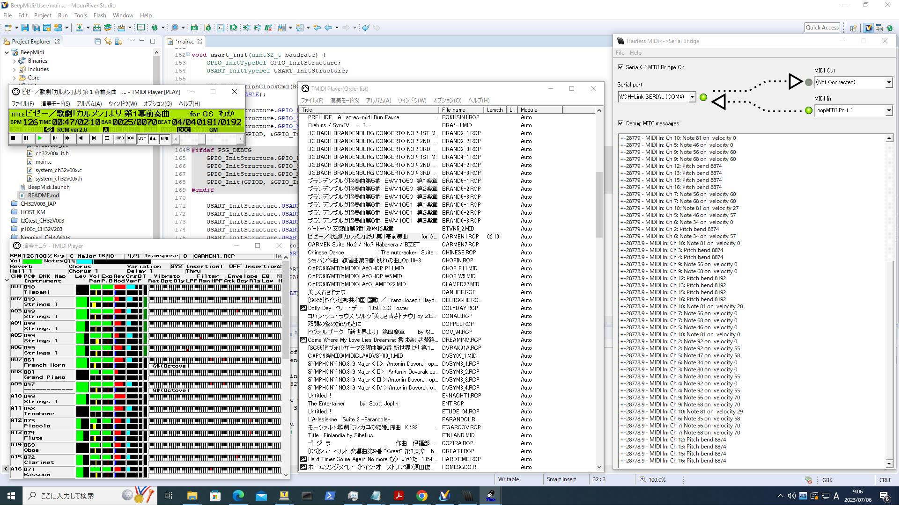
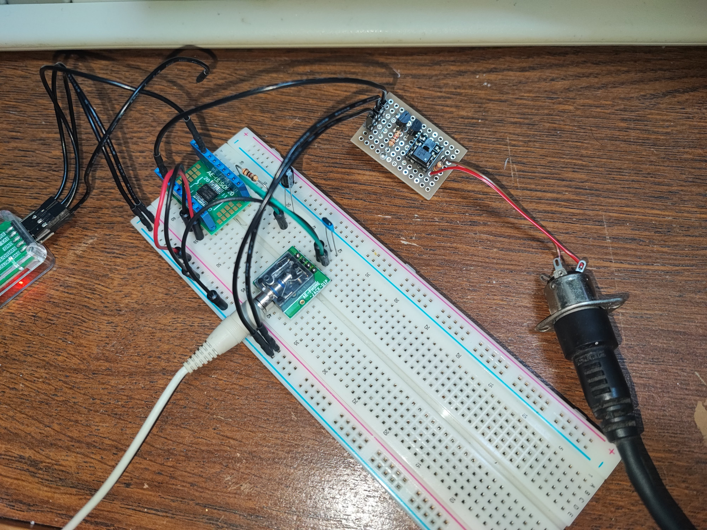
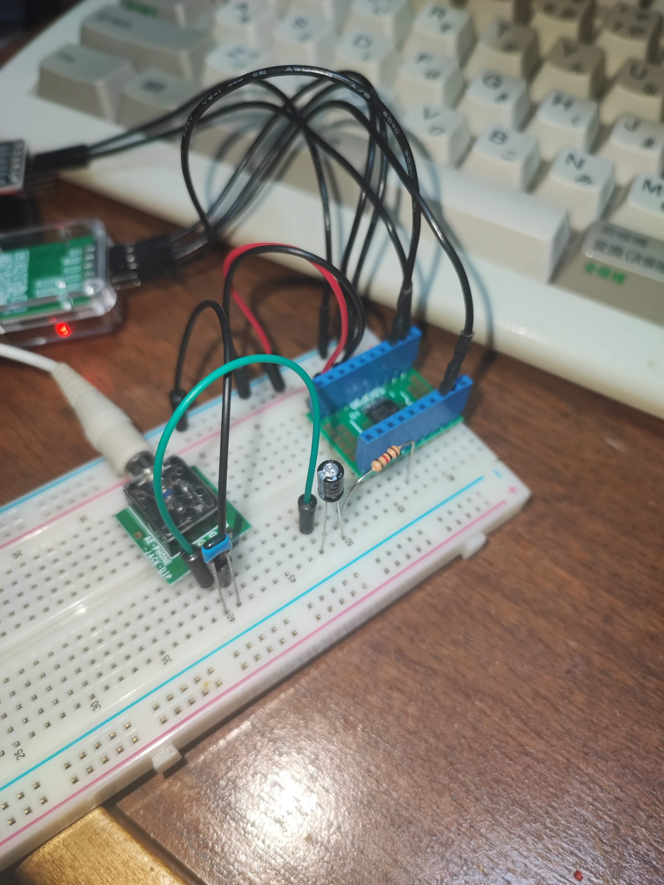

# BeepMIDI player for CH32V003

CH32V003 用の BEEP 音を使った MIDI 音源です。
MIDI CH10 以外の音を先着順に12音まで発生できます。

## 使い方
シリアルポートを使う場合は、何らかの USB-Serial ブリッジ(みんな持ってる WCH-LinkE でOK)を経由して、PD6につなぎます。
Windows から鳴らす場合は LoopMidi と Hairless MIDI-Serial Bride を使えば、任意の MIDI プレイヤーの出力を流すことができます。 

シリアルポートのビットレートを 31250 にして、適当な MIDI 入力回路(市販の Arduino用 MIDI Hatなど)を使えば、
本物の MIDI からデータをもらうこともできます。 

音声は PC4 に PWM で出力されますので、適当なフィルタをかませて、ライン入力などにつなぎます。
そのまま圧電ブザーなどにつないでもOKです 

内部オシレータを使う場合は、クロックの設定が 48MHz HSI になっていることを確認してください。 
8 ピン版でも使えるようにしているつもりですが、使えないピンがありましたら変更してください。 

## 解説
シリアルポートの入力は DMA を Circular モードで使っています。
WCH のサンプルにあるポーリング制御では、大量のデータ取りこぼしが発生したので悩んでいたのですが、
STM32 ならこうするという話が Web 上にたくさんありましたので、参考にしました。 

発音の方は、各CH ごとに矩形波を生成して、合成してるだけです。
合成した結果を約 190kHz (48MHz/256) の PWM で 256階調で出力しています。

PSG もどきのコードを流用したので、名残があります。
PSG はボリュームの設定値が非線形なので、線形にしたほうがいいかもしれません。 

## 制限事項
- MIDI のメッセージは、ごく一部しか解釈していません。
- MIDI ファイルによってはうまく再生できないものもあります
- CH32V203 用の設定もありますが、テストしていません(というか次のネタです)