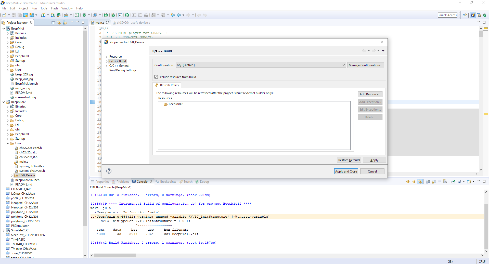
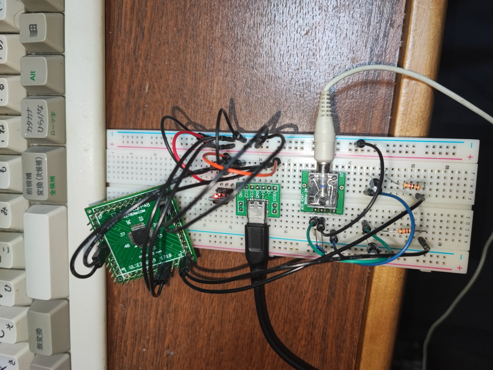
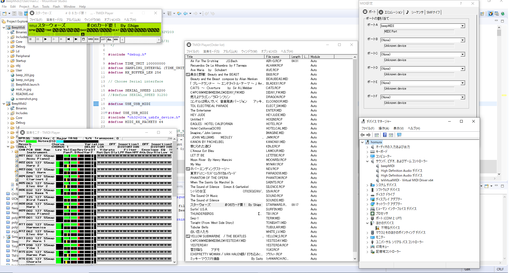
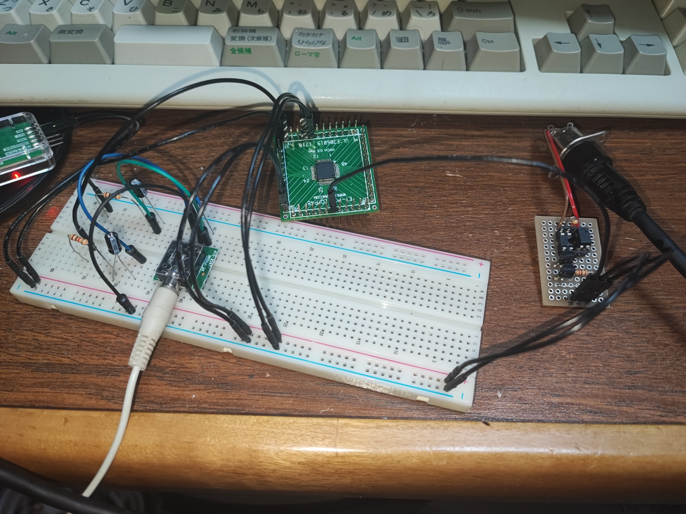

# BeepMIDI player for CH32V003/203

CH32V003/203 用の BEEP 音を使った MIDI 音源です。
MIDI CH10 以外の音を先着順に12音まで(203なら36音)発声できます。
(CH10 は GM ではドラムなので…) 
CH32V203 では USB MIDI にも対応しています。
PCに接続すると直接 USB MIDI デバイスとして認識されます。

## 使い方

プロジェクトは MounRiverStudio のCH32V003 の設定になっています。
CH32V203 で使う場合は、新しいプロジェクトを作った上で、User/main.c をコピーしてください。
また USB を使う場合は usbmidi.h と USB_Device フォルダもコピーしてください。
クロックの設定を忘れずに 144MHz に変えてください。 

USB MIDI未使用時に(CH32V003 使用時)USB 関連のファイルが入っていると build が通らないので、
シリアルポート版を build するときは、USB_Device フォルダを build 範囲から除外してください。
(逆にUSB版を build するときは除外を外すのをわすれずに) 

シリアルポートを使う場合は、何らかの USB-Serial ブリッジ(みんな持ってる WCH-LinkE でOK)を経由して、
USART1 の RX である PD6 (203なら PA11)につなぎます。
Windows から鳴らす場合は LoopMidi と Hairless MIDI-Serial Bride を使えば、任意の MIDI プレイヤーの出力を流すことができます。 

シリアルポートのビットレートを 31250 にして、適当な MIDI 入力回路(市販の Arduino用 MIDI Hatなど)を使えば、
本物の MIDI からデータをもらうこともできます。 

CH32V203で USB を使う場合は USBOTG 側を使います。
PB6 と PB7 を USB の D- と D+ につなぎます。 

USBから給電して動作させるとこんな感じになります。
フラッシュの書き込みも USB 経由で出来ます。 

PCからは USB MIDI デバイスとして見えるので、直接 MIDI 対応ソフトから出力できます。

音声は PC4 に PWM で出力されますので、適当なフィルタをかませて、ライン入力などにつなぎます。
そのまま圧電ブザーなどにつないでもOKです 

CH32V203の場合は複数の PWM (TIM2CH1~CH4)に分散して出力できるようになっています、標準では PA3 (CH4)と PA2 (CH3)を使っています 

内部オシレータを使う場合は、クロックの設定が 48MHz HSI (203の場合 144MHz HSI)になっていることを確認してください。 
CH32V003の 8 ピン版でも使えるようにしているつもりですが、使えないピンがありましたら変更してください。 

## 解説
シリアルポートの入力は DMA を Circular モードで使っています。
WCH のサンプルにあるポーリング制御では、大量のデータ取りこぼしが発生したので悩んでいたのですが、
STM32 ならこうするという話が Web 上にたくさんありましたので、参考にしました。 

発音の方は、各CH ごとに矩形波を生成して、合成してるだけです。
合成した結果を約 190kHz (=SystemCoreClock/256) の PWM で 256階調で出力しています。
203 の場合 TIM1 と USART1 のピンが被るので、TIM2 を使っています 

以前の版では対数ボリュームにしていましたが、線形ボリュームに変更しました。 

## USB解説

CH32V の USB はライブラリと呼べるようなものがないのでアレなのですが、
公式サンプルの SimulateCDC を改変しています。 
CH32V203 には USB が2系統ありますが、USBD と USBOTG は全く違う構造なので、
このままでは USBOTG がピンに出ていない CH32V203K8 などでは動作しません。
(開発ボードの USBD がAコネクタなのはなぜなのか…) 

ちなみに USBD は STM32F1 あたりと同じ構造っぽいですけど、
USBOTG は STM32F4 と全く違います。元ネタは CH559 あたりと思われますがかなり変態っぽいです。
(GD32VF の USBOTG は STM32F4 と同じっぽいのに…) 
CH32V の USBOTG はエンドポイント毎にDMA転送アドレスを設定しておくと、
各エンドポイントで受信したデータを勝手にRAMに転送して、完了割り込みをかけてくれます。
割り込みかかるたびに転送アドレスを変えることで、リングバッファ的な動作が比較的楽に実装できます。 

STM32は外部クロック使わないとUSB 使えませんが、
CH32Vは内部クロックでも FullSpeed なら充分な精度はあるようで、問題なく動作します。 

USB MIDI の資料については、
[シンセ・アンプラグド](https://pcm1723.hateblo.jp/archive/category/USB-MIDI)を参考にさせていただきました。
デスクプリタまわりはほぼ丸パクリです 
USBOTG では同じ番号のエンドポイントで送受信させるのが面倒っぽいので、
受信側のエンドポイント番号を 2 に変更しています。
(もともとの simulateCDC が受信に Endpoint2 を使ってたので…) 

USB の VID/PID は
[pid.codes](https://pid.codes/)のOSS向け開発用コードを使っています。
このまま製品に使うことはできません。(そんな人いないわ…) 

## 制限事項
- MIDI のメッセージは、ごく一部しか解釈していません。
- MIDI ファイルによってはうまく再生できないものもあります